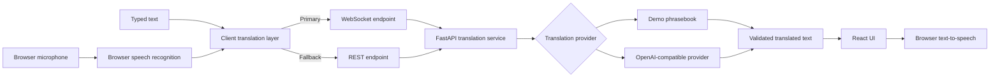

# LiveTranslate

Real-time multilingual speech translation built as a recruiter-ready AI engineering portfolio MVP.


LiveTranslate turns browser speech into text, translates it through a FastAPI backend, and can read the translated result aloud. The project is designed to demonstrate more than a single API call: it includes streaming transport, fallback behaviour, provider abstraction, failure recovery, input validation, request limits, Docker packaging, and automated CI.

> Portfolio status: functional MVP. It is suitable for everyday conversational demos, not emergency, legal, medical, or safety-critical interpretation.

## What the app does

- Captures one spoken utterance at a time through browser speech recognition.
- Shows partial transcript feedback while the user is speaking.
- Sends text over WebSocket for the primary translation flow.
- Automatically falls back to REST if the WebSocket is unavailable.
- Supports typed-text translation on browsers without speech recognition.
- Supports eight selectable languages: English, Hindi, Telugu, Tamil, Spanish, French, German, and Japanese.
- Reads translated text aloud using browser text-to-speech.
- Keeps an in-session conversation history with copy, clear, and local `.txt` export.
- Includes a no-key demo phrasebook so the repository can be demonstrated without paid API access.
- Supports an optional OpenAI-backed provider for arbitrary translation text.

## Why this project is useful in an AI engineering portfolio

LiveTranslate demonstrates the engineering around an AI capability, not only the model call itself:

- **Real-time application design:** WebSocket transport for interactive translation.
- **Resilience:** REST fallback, request timeouts, and restoration of failed user input.
- **Provider abstraction:** the UI is independent from whether translation comes from the deterministic demo provider or an OpenAI-compatible model.
- **Safe failure behaviour:** unsupported demo text returns an explicit error rather than pretending the input was translated.
- **Backend protections:** paid-provider traffic is constrained with per-process rate and concurrency limits.
- **Secret isolation:** provider credentials stay on the backend and are never exposed to the React client.
- **Reproducibility:** Docker, lockfiles, tests, and GitHub Actions make the project straightforward to verify.

## Architecture



The browser speech-recognition implementation may process audio on the browser vendor's infrastructure. LiveTranslate's backend receives text, not raw microphone audio.

For the deeper design notes, see [`docs/ARCHITECTURE.md`](docs/ARCHITECTURE.md).

## Demo flow

A recruiter can understand the product in under a minute:

1. Choose a source and target language.
2. Type a phrase, or use the microphone where browser support is available.
3. Submit it and watch the result appear through the real-time translation flow.
4. Play the translated output using text-to-speech.
5. Disconnect or block the WebSocket to see the client fall back to REST.
6. Switch the backend to the OpenAI provider to translate arbitrary text instead of the deterministic demo phrasebook.

## Technology

| Layer | Technology |
| --- | --- |
| Frontend | React 19, TypeScript, Vite |
| Real-time transport | WebSocket with REST fallback |
| Backend | FastAPI, Pydantic |
| AI provider | Optional OpenAI-compatible translation provider |
| Speech | Browser speech recognition and browser text-to-speech |
| Packaging | Docker, Docker Compose, Nginx |
| Quality | Pytest, ESLint, production frontend build, GitHub Actions |

## Run locally

### One-command Docker setup

```bash
cp .env.example .env
docker compose up --build
```

Open `http://localhost:8080`. The default `demo` provider works without an API key.

### Development setup

Backend:

```bash
cd backend
python -m venv .venv
source .venv/bin/activate
pip install -r requirements-dev.txt
uvicorn app.main:app --reload
```

Frontend, in another terminal:

```bash
cd frontend
npm install
npm run dev
```

Open `http://localhost:5173`.

## Enable full AI translation

The demo provider intentionally supports only a small reproducible phrase set. Unsupported text returns an explicit error and is never presented as a translation.

To translate arbitrary text, configure the backend:

```env
TRANSLATION_PROVIDER=openai
OPENAI_API_KEY=your_key
OPENAI_MODEL=gpt-5-mini
```

Restart the backend after changing environment variables. Never commit `.env` and never expose the provider key to the frontend.

## Reliability decisions

- Microphone input captures one utterance per tap rather than maintaining an uncontrolled always-on stream.
- Language controls are locked while capture or translation is in progress.
- Failed or timed-out translation requests restore the submitted text to the user.
- Malformed provider output is rejected instead of rendered as a successful translation.
- WebSocket input and origin handling are validated by the backend.
- If the WebSocket drops, later requests can continue through REST.
- Paid-provider requests are capped at 30 per minute and two concurrent requests per backend process.

These limits are intentionally simple for an MVP; they are not a distributed quota system or a replacement for authentication in a public production deployment.

## Test and build

```bash
cd backend && pytest -q
cd ../frontend && npm run lint && npm run build
```

The repository's GitHub Actions workflow runs the verification path automatically on changes to `main`.

## Deployment notes

The included Dockerfiles support a two-service deployment:

1. Deploy `backend/` as a private Python web service on a container platform.
2. Deploy `frontend/` as the public web service, or build it as static assets with `VITE_API_URL` pointing to the backend.
3. Use HTTPS; browsers require a secure context for microphone access outside localhost.
4. Configure `ALLOWED_ORIGINS` to the exact frontend origin.
5. Keep translation-provider credentials only in backend environment variables.

For a single-host demo, `docker-compose.yml` can run behind a TLS reverse proxy such as Caddy.

## Product boundaries

LiveTranslate is a portfolio MVP for everyday conversation. Translation quality depends on the configured provider, speech recognition varies by browser and operating system, and conversation history currently lives in page memory unless the user exports it.
