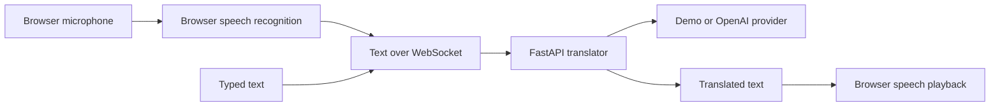

# LiveTranslate

LiveTranslate is a privacy-aware, real-time translation workspace built as a portfolio-ready MVP. It turns browser speech into text, streams it to a FastAPI translation service, and can read the translation aloud without uploading raw microphone audio.


## MVP capabilities

- Live browser speech recognition with partial-transcript feedback
- Streaming translations over WebSocket, with automatic REST fallback
- Typed-text mode on every browser
- Eight selectable languages: English, Hindi, Telugu, Tamil, Spanish, French, German, and Japanese
- Browser text-to-speech playback
- Conversation history, copy, clear, and local `.txt` export
- No-key demo phrasebook for a reproducible portfolio demo
- Optional OpenAI-powered translation for arbitrary text
- Responsive, accessible React UI
- FastAPI validation, provider abstraction, tests, Docker, and GitHub Actions CI

## Architecture



Raw microphone audio stays inside the browser. Browser speech recognition support and implementation vary by browser and operating system.

## Run locally

### One-command Docker setup

```bash
cp .env.example .env
docker compose up --build
```

Open [http://localhost:8080](http://localhost:8080). The default `demo` provider works without an API key.

### Development setup

Backend:

```bash
cd backend
python -m venv .venv
source .venv/bin/activate
pip install -r requirements-dev.txt
uvicorn app.main:app --reload
```

Frontend, in another terminal:

```bash
cd frontend
npm install
npm run dev
```

Open [http://localhost:5173](http://localhost:5173).

## Enable full translation

The demo provider translates a small phrasebook and clearly labels unmatched content. To translate arbitrary text, set:

```env
TRANSLATION_PROVIDER=openai
OPENAI_API_KEY=your_key
OPENAI_MODEL=gpt-5-mini
```

Restart the backend after changing environment variables. Never commit `.env` or expose the API key to the frontend.

## Test and build

```bash
cd backend && pytest -q
cd ../frontend && npm run lint && npm run build
```

## Deployment

The included Dockerfiles support a two-service deployment:

1. Deploy `backend/` as a private Python web service on Render, Railway, Fly.io, or a container platform.
2. Deploy `frontend/` as the public web service, or build it as static assets with `VITE_API_URL` pointing at the backend.
3. Configure HTTPS. Browsers require a secure context for microphone access outside localhost.
4. Set `ALLOWED_ORIGINS` to the exact production frontend URL.
5. Set the translation provider and secret only in the backend environment.

For the simplest single-host setup, deploy `docker-compose.yml` on a small VM and terminate TLS with a reverse proxy such as Caddy.

## Product boundaries

This MVP is intended for everyday conversation, not emergency, legal, medical, or safety-critical interpretation. Translation quality depends on the configured provider, and browser speech recognition is not available on every browser.

