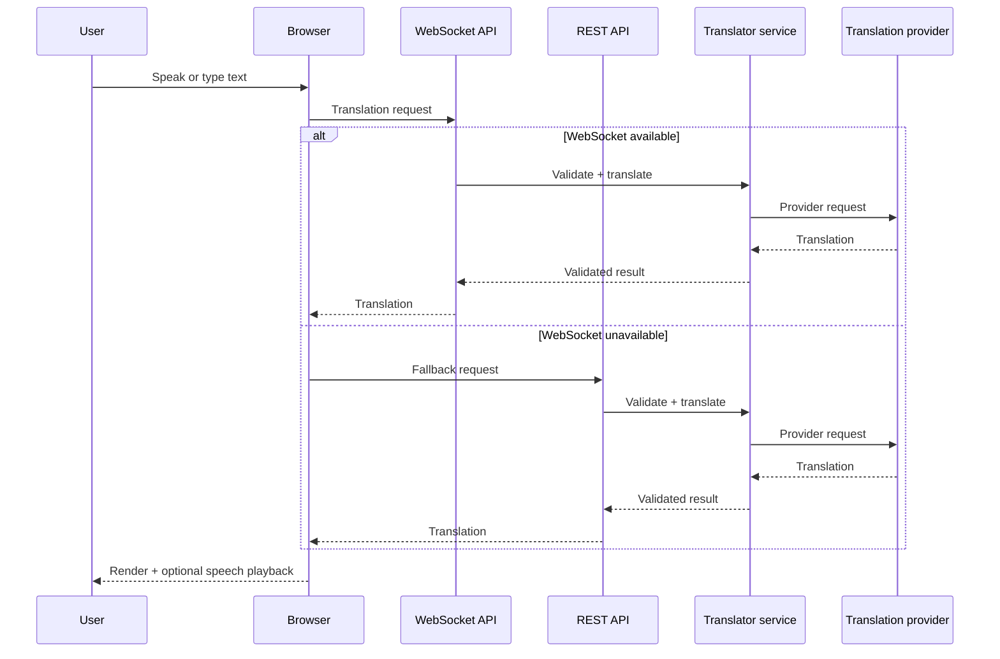

# LiveTranslate architecture

This document explains the engineering decisions behind the LiveTranslate portfolio MVP.

## System goals

LiveTranslate was designed around four constraints:

1. A user should be able to speak or type and receive a translation with minimal friction.
2. The core demo should still work without a paid AI key.
3. A dropped real-time connection should not make the entire application unusable.
4. AI-provider behaviour should be isolated from the UI so providers can be changed without rewriting the product flow.

## Request flow



## Frontend responsibilities

The React/TypeScript client owns interaction state rather than model logic. It handles:

- language selection;
- microphone capture through browser speech-recognition APIs;
- partial transcript display;
- typed input;
- WebSocket lifecycle management;
- REST fallback when real-time transport fails;
- restoration of submitted text after failed or timed-out requests;
- conversation history in page memory;
- copy, clear, local text export, and text-to-speech playback.

Keeping provider credentials and translation logic out of the browser makes the client replaceable and avoids leaking secrets.

## Backend responsibilities

The FastAPI backend is responsible for:

- validating incoming translation requests;
- enforcing supported language codes;
- exposing REST and WebSocket interfaces;
- checking WebSocket message structure and origin expectations;
- delegating translation to the configured provider;
- rejecting malformed provider responses;
- applying simple rate and concurrency controls around paid-provider calls;
- returning a consistent response shape to the frontend.

## Provider abstraction

Two provider paths are intentionally supported.

### Demo provider

The deterministic phrasebook exists so the repository can be cloned and demonstrated without an API key. Its limitations are explicit: unsupported text returns an error instead of being echoed back or misrepresented as translated output.

### OpenAI-compatible provider

The optional AI provider accepts arbitrary text. The backend constructs the request, validates the returned content, and keeps the API key server-side.

The provider boundary is important because the product flow does not depend on a specific model vendor.

## Failure behaviour

LiveTranslate treats failure handling as part of the product design:

- A WebSocket failure does not permanently block translation; REST remains available.
- Request timeouts prevent the UI from waiting indefinitely.
- Failed submissions restore the user's original text.
- Provider output is validated before it is shown as a successful translation.
- Controls are locked during active capture/translation to avoid accidental overlapping requests.
- Paid-provider traffic is bounded to reduce accidental cost spikes in an MVP deployment.

## Security and privacy boundaries

- Provider secrets are stored only in backend environment variables.
- The browser may send microphone audio to the browser vendor's speech service; the LiveTranslate backend receives the resulting text.
- CORS/origin configuration should be restricted to the deployed frontend origin.
- Public paid-provider deployments should add real user authentication and distributed rate limiting; the current process-local limiter is intentionally MVP-scoped.

## Deployment model

The repository supports a simple two-service deployment:

```text
Internet
   |
   v
Frontend / Nginx
   |
   | HTTPS / WSS
   v
FastAPI backend
   |
   v
Configured translation provider
```

The frontend and backend each have Dockerfiles, and Docker Compose provides the shortest local demonstration path.

## What this architecture demonstrates

From an engineering perspective, LiveTranslate is intended to show experience with:

- real-time WebSocket applications;
- graceful protocol fallback;
- asynchronous FastAPI services;
- AI-provider abstraction;
- validation of model/provider output;
- browser speech interfaces;
- Dockerized deployment;
- automated backend and frontend verification.
